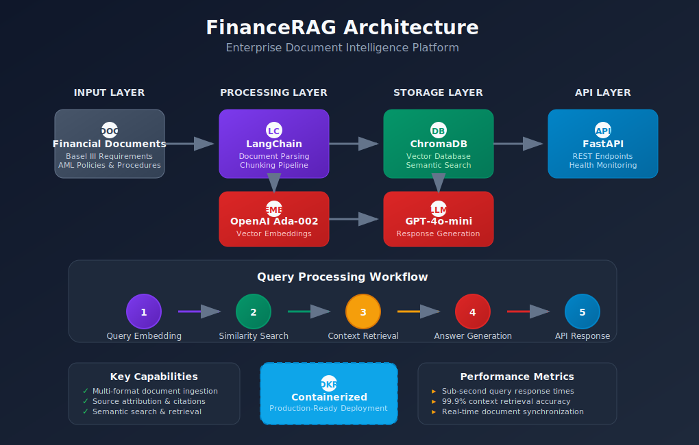

# 🏦 FinanceRAG


A **production-grade RAG (Retrieval-Augmented Generation) system** for financial document Q&A. Built with LangChain, ChromaDB, and FastAPI, this system enables intelligent querying of financial regulations, compliance policies, and risk management documents.

## 🏗️ System Architecture



### Pipeline Flow

| Stage | Component | Purpose |
|-------|-----------|---------|
| 1 | **Document Processor** | Load and chunk PDF, DOCX, TXT, MD files |
| 2 | **Embeddings Pipeline** | Generate vector embeddings (OpenAI Ada-002) |
| 3 | **Vector Store** | Store and index embeddings (ChromaDB) |
| 4 | **Retriever** | Semantic similarity search |
| 5 | **LLM Chain** | Generate answers with context (GPT-4o-mini) |
| 6 | **FastAPI** | REST API with health checks |

## 🎯 Features

- **Multi-format Support**: PDF, DOCX, TXT, Markdown
- **Semantic Search**: Vector similarity retrieval with ChromaDB
- **Source Attribution**: Every answer includes document sources
- **REST API**: Production-ready FastAPI endpoints
- **Docker Ready**: Containerized deployment
- **Observability**: Structured logging throughout

## 🚀 Quick Start

### Prerequisites

- Python 3.10+
- OpenAI API key

### Installation

```bash
# Clone the repository
git clone https://github.com/Dewale-A/FinanceRAG.git
cd FinanceRAG

# Create virtual environment
python -m venv venv
source venv/bin/activate  # Windows: venv\Scripts\activate

# Install dependencies
pip install -r requirements.txt

# Configure environment
cp .env.example .env
# Edit .env and add your OPENAI_API_KEY
```

### Usage

```bash
# 1. Ingest sample financial documents
python main.py ingest --source ./sample_docs

# 2. Query interactively
python main.py query

# 3. Or ask a specific question
python main.py query -q "What is the minimum CET1 ratio under Basel III?"

# 4. Start API server
python main.py serve

# 5. Check stats
python main.py stats
```

### Docker Deployment

```bash
# Build and run with Docker Compose
docker-compose up -d

# Check health
curl http://localhost:8000/health

# Query via API
curl -X POST http://localhost:8000/query \
  -H "Content-Type: application/json" \
  -d '{"question": "What are the requirements for Enhanced Due Diligence?"}'
```

## 📚 Sample Documents

The system includes sample financial documents covering:

| Document | Domain | Topics |
|----------|--------|--------|
| `basel_iii_capital_requirements.md` | Regulatory | CET1, Tier 1, LCR, NSFR ratios |
| `aml_policy.md` | Compliance | KYC, CDD, EDD, SAR filing |
| `credit_risk_framework.md` | Risk | Credit scoring, provisioning, stress testing |
| `data_governance_policy.md` | Governance | CDEs, data quality, classification |
| `loan_underwriting_guidelines.md` | Operations | DTI, LTV, credit requirements |

## 🔧 API Endpoints

| Method | Endpoint | Description |
|--------|----------|-------------|
| GET | `/` | API info |
| GET | `/health` | Health check with stats |
| POST | `/query` | RAG query |
| POST | `/chat` | Query with conversation history |
| POST | `/ingest` | Ingest from path |
| POST | `/ingest/upload` | Upload and ingest file |
| GET | `/stats` | Vector store statistics |
| DELETE | `/collection` | Clear all documents |

### Query Example

```bash
curl -X POST http://localhost:8000/query \
  -H "Content-Type: application/json" \
  -d '{
    "question": "What is the minimum capital conservation buffer?",
    "k": 5
  }'
```

**Response:**
```json
{
  "answer": "The capital conservation buffer under Basel III is 2.5% of Risk-Weighted Assets (RWA), which must be held in Common Equity Tier 1 (CET1) capital...",
  "sources": [
    {
      "filename": "basel_iii_capital_requirements.md",
      "chunk_index": 3,
      "relevance_score": 0.89,
      "preview": "### Capital Conservation Buffer\n\n**Requirement: 2.5% of RWA (CET1)**..."
    }
  ],
  "query": "What is the minimum capital conservation buffer?",
  "documents_retrieved": 5,
  "model": "gpt-4o-mini"
}
```

## 📁 Project Structure

```
FinanceRAG/
├── main.py                    # CLI entry point
├── requirements.txt           # Python dependencies
├── Dockerfile                 # Container definition
├── docker-compose.yml         # Container orchestration
├── .env.example              # Environment template
├── sample_docs/              # Sample financial documents
│   ├── basel_iii_capital_requirements.md
│   ├── aml_policy.md
│   ├── credit_risk_framework.md
│   ├── data_governance_policy.md
│   └── loan_underwriting_guidelines.md
├── data/
│   └── chroma/               # Vector store persistence
├── docs/
│   └── architecture.svg      # System diagram
└── src/
    ├── api/
    │   └── main.py           # FastAPI application
    ├── config/
    │   └── settings.py       # Configuration management
    └── tools/
        ├── document_processor.py  # Document loading/chunking
        ├── vector_store.py        # ChromaDB operations
        └── rag_chain.py           # RAG pipeline
```

## ⚙️ Configuration

Key settings in `.env`:

```bash
# Required
OPENAI_API_KEY=sk-...

# Models
LLM_MODEL=gpt-4o-mini          # Or gpt-4o for higher quality
EMBEDDING_MODEL=text-embedding-ada-002

# Chunking
CHUNK_SIZE=1000                # Characters per chunk
CHUNK_OVERLAP=200              # Overlap between chunks

# Retrieval
TOP_K_RESULTS=5                # Documents to retrieve

# API
API_HOST=0.0.0.0
API_PORT=8000
```

## 🔍 How It Works

1. **Document Ingestion**
   - Documents are loaded and split into chunks (default 1000 chars, 200 overlap)
   - Each chunk is embedded using OpenAI's text-embedding-ada-002
   - Embeddings are stored in ChromaDB for fast retrieval

2. **Query Processing**
   - User question is embedded using the same model
   - ChromaDB performs similarity search to find relevant chunks
   - Top-k chunks are retrieved with their source metadata

3. **Answer Generation**
   - Retrieved chunks are formatted as context
   - GPT-4o-mini generates an answer based on the context
   - Sources are included for transparency and verification

## 📈 Future Enhancements

- [ ] Hybrid search (semantic + keyword)
- [ ] Multi-modal support (tables, charts)
- [ ] Conversation memory with Redis
- [ ] Evaluation metrics and monitoring
- [ ] Kubernetes deployment manifests
- [ ] Authentication and rate limiting

## 📜 License

MIT License - see [LICENSE](LICENSE) for details.

## 👤 Author

**Dewale A** - AI Systems Engineer
- GitHub: [@Dewale-A](https://github.com/Dewale-A)
- LinkedIn: [Connect](https://linkedin.com/in/waleaderonmu)

---

*Built as part of a portfolio demonstrating production-grade RAG systems for enterprise financial services.*
